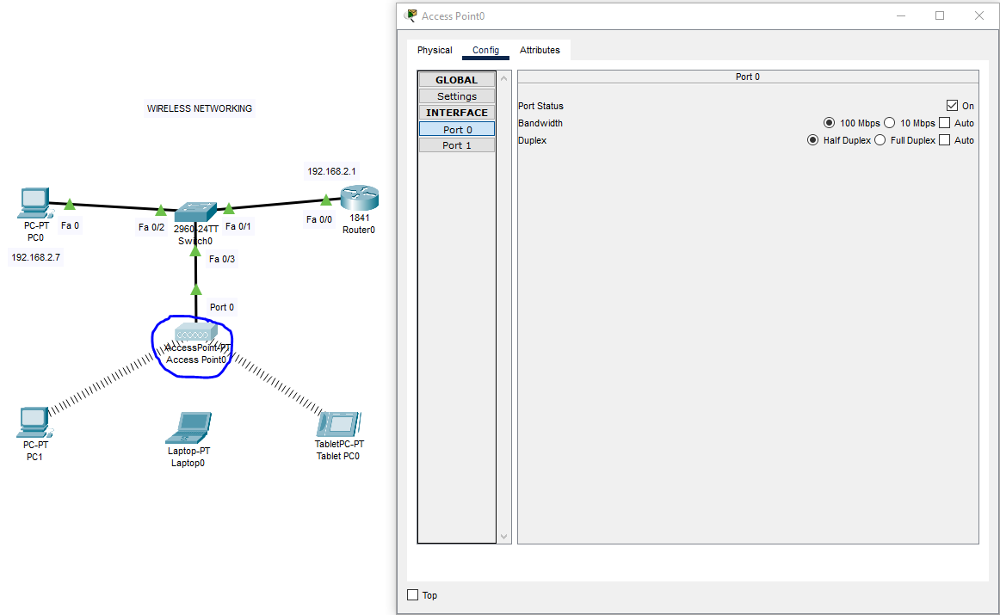

# Wireless-Networking-CiscoPT-Lab

## Opis laboratorium

Celem laboratorium jest skonfigurowanie i przetestowanie sieci bezprzewodowej w środowisku Cisco Packet Tracer. W ramach ćwiczenia nauczysz się:  
- Dodawać moduły bezprzewodowe do komputerów,  
- Konfigurować Access Point oraz router,  
- Łączyć urządzenia końcowe z siecią Wi-Fi zabezpieczoną WPA2-PSK,  
- Rozumieć różnice między protokołami zabezpieczeń WEP, WPA-PSK i WPA2-PSK.  

---

## Schemat sieci

Poniżej znajduje się przykładowy schemat topologii sieci, który będziemy konfigurować:


---

## Konfiguracja urządzeń

### Zmiana modułu Ethernet na bezprzewodowy

Aby komputer PC lub laptop mógł połączyć się z siecią Wi-Fi, musi posiadać odpowiedni moduł bezprzewodowy (np. WMP300N).

#### Przykład (PC1):

1. Wyłącz komputer – kliknij żółty przycisk zasilania.  
2. Dodaj moduł WMP300N do wolnego slotu.  
3. Włącz komputer – kliknij ponownie przycisk zasilania.  


Analogicznie, dla laptopa również należy wymienić moduł Ethernet na bezprzewodowy:


---

### Konfiguracja Access Pointa

1. Przejdź do zakładki **Config** Access Pointa.  
2. Skonfiguruj nazwę sieci (SSID), tryb pracy, zabezpieczenia (WPA2-PSK) oraz hasło.  
3. Ustaw porty Access Pointa, aby prawidłowo obsługiwały ruch bezprzewodowy i przewodowy.

Konfiguracja portu 0 (zwykle port bezprzewodowy):



Konfiguracja portu 1 (np. port przewodowy lub uplink):


---

### Konfiguracja routera

1. Przejdź do konfiguracji routera (**Config** lub **CLI**).  
2. Ustaw adres IP interfejsu oraz bramę domyślną, aby zapewnić komunikację między siecią przewodową a bezprzewodową.


```

interface FastEthernet0/0
 no ip address
 ip address 192.168.2.1 255.255.255.0
 no shutdown
end
```

---

### Konfiguracja urządzeń końcowych (PC, Laptop, Tablet)

#### PC i Laptop

Aby połączyć się z siecią bezprzewodową, urządzenie musi mieć włączony moduł Wi-Fi oraz poprawnie skonfigurowane połączenie.

Na PC przejdź do **Desktop** > **PC Wireless** > **Manage Wireless Networks**, aby zarządzać sieciami Wi-Fi:


Następnie wybierz sieć i wprowadź hasło.

Konfiguracja PC1:


Konfiguracja PC0:


Konfiguracja laptopa:


#### Tablet

Tablet również musi mieć poprawnie skonfigurowane połączenie Wi-Fi z odpowiednimi zabezpieczeniami.

Konfiguracja autoryzacji sieci bezprzewodowej na tablecie (wybór WPA2-PSK):


Pełna konfiguracja tabletu do pracy w sieci Wi-Fi:


---

## Łączenie się z siecią bezprzewodową

Aby połączyć się z siecią Wi-Fi:

1. Upewnij się, że urządzenie posiada moduł bezprzewodowy.  
2. Wybierz sieć Wi-Fi z listy dostępnych.  
3. Wprowadź hasło WPA2-PSK.  
4. Połącz się i sprawdź połączenie (np. ping do routera).


---

## Wyjaśnienie: Dlaczego parametry zabezpieczeń muszą być identyczne? 

Obie strony – punkt dostępowy (Access Point) i urządzenie klienckie (tablet, laptop, telefon) – muszą mieć skonfigurowane dokładnie te same parametry bezpieczeństwa, aby móc nawiązać połączenie i bezpiecznie się komunikować.

Dzieje się tak, ponieważ:

- **Uwierzytelnienie:** Gdy urządzenie klienckie próbuje połączyć się z siecią Wi-Fi zabezpieczoną WPA2-PSK, odbywa się proces zwany "4-way handshake" (czterostopniowe uzgadnianie klucza). W tym procesie obie strony (AP i klient) udowadniają sobie nawzajem, że znają ten sam, wspólny sekretny klucz (czyli hasło WPA2-PSK), nie wysyłając samego hasła w jawnej formie.  
- **Generowanie Kluczy Szyfrujących:** Na podstawie tego wspólnego hasła (PSK), unikalnych identyfikatorów obu urządzeń (np. adresów MAC) i losowo generowanych danych, obie strony (AP i klient, niezależnie od siebie) generują te same, tymczasowe klucze szyfrujące, które będą używane do szyfrowania i deszyfrowania całego ruchu danych przesyłanego między nimi podczas tej konkretnej sesji połączenia.

Jeśli hasło (PSK Pass Phrase) lub metoda autoryzacji (WPA2-PSK) skonfigurowana na tablecie różni się od tej na punkcie dostępowym, proces "4-way handshake" zakończy się niepowodzeniem, ponieważ strony nie będą w stanie udowodnić sobie, że znają ten sam sekret, ani wygenerować wspólnych kluczy szyfrujących. Połączenie nie zostanie nawiązane lub będzie niestabilne/niezabezpieczone (w przypadku starszych, niebezpiecznych protokołów).

---

## Różnice między WEP, WPA-PSK i WPA2-PSK

**WEP, WPA-PSK i WPA2-PSK** to protokoły zabezpieczeń sieci Wi-Fi, ale znacznie różnią się poziomem bezpieczeństwa, sposobem szyfrowania i odpornością na ataki.

### WEP (Wired Equivalent Privacy)
- **Najstarszy protokół** – wprowadzony w 1999 roku, obecnie uznawany za przestarzały i niezalecany do użycia.  
- **Szyfrowanie:** wykorzystuje algorytm RC4 i klucze o długości 64 lub 128 bitów.  
- **Bezpieczeństwo:** bardzo słabe – WEP można złamać w kilka minut nawet przy użyciu prostych narzędzi.  
- **Uwierzytelnianie:** jeden klucz dla wszystkich użytkowników, wpisywany ręcznie.  
- **Wady:** liczne luki bezpieczeństwa, brak dynamicznej zmiany kluczy, podatność na ataki.  

### WPA-PSK (Wi-Fi Protected Access – Pre-Shared Key)
- **Następca WEP** – wprowadzony jako szybka poprawka bezpieczeństwa.  
- **Szyfrowanie:** używa protokołu TKIP (Temporal Key Integrity Protocol), który dynamicznie zmienia klucze i zapewnia lepszą ochronę niż RC4.  
- **Długość klucza:** co najmniej 8 znaków, maksymalnie 63 znaki.  
- **Uwierzytelnianie:** wszyscy użytkownicy korzystają z tego samego hasła (klucz wstępny).  
- **Bezpieczeństwo:** znacznie wyższe niż WEP, ale obecnie również podatne na niektóre ataki, zwłaszcza przy słabych hasłach.  

### WPA2-PSK (Wi-Fi Protected Access II – Pre-Shared Key)
- **Następca WPA** – wprowadzony w 2004 roku, obecnie standard w większości urządzeń.  
- **Szyfrowanie:** wykorzystuje AES (Advanced Encryption Standard), znacznie silniejszy od TKIP i RC4.  
- **Długość klucza:** taki sam jak w WPA-PSK (8–63 znaki).  
- **Uwierzytelnianie:** również opiera się na wspólnym haśle dla wszystkich użytkowników (tryb Personal/PSK).  
- **Bezpieczeństwo:** bardzo wysokie – włamanie do sieci WPA2-PSK jest bardzo trudne, jeśli hasło jest mocne.  

### Porównanie

| Cecha                | WEP                  | WPA-PSK                    | WPA2-PSK                   |  
|----------------------|----------------------|----------------------------|----------------------------|  
| Rok wprowadzenia     | 1999                 | 2003                       | 2004                       |  
| Algorytm szyfrowania | RC4                  | TKIP (dynamiczny klucz)    | AES (CCMP, bardzo silny)   |  
| Długość klucza       | 64/128 bitów         | 128 bitów                  | 256 bitów                  |  
| Bezpieczeństwo       | Bardzo słabe         | Średnie                    | Bardzo wysokie             |  
| Łatwość złamania     | Bardzo łatwa         | Możliwa przy słabym haśle  | Bardzo trudna              |  
| Zalecane użycie      | Nie                  | Tylko jeśli brak WPA2      | Tak, domyślnie             |  

### Podsumowanie

- **WEP** jest przestarzały i nie powinien być używany – łatwo go złamać.  
- **WPA-PSK** to lepsze rozwiązanie niż WEP, ale obecnie też nie zapewnia pełnego bezpieczeństwa.  
- **WPA2-PSK** jest obecnie standardem i zapewnia bardzo wysoki poziom ochrony, jeśli używasz silnego hasła.  
